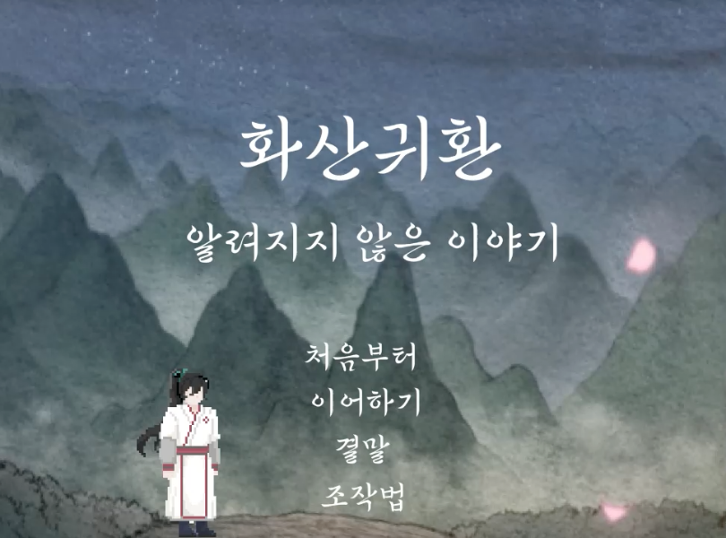
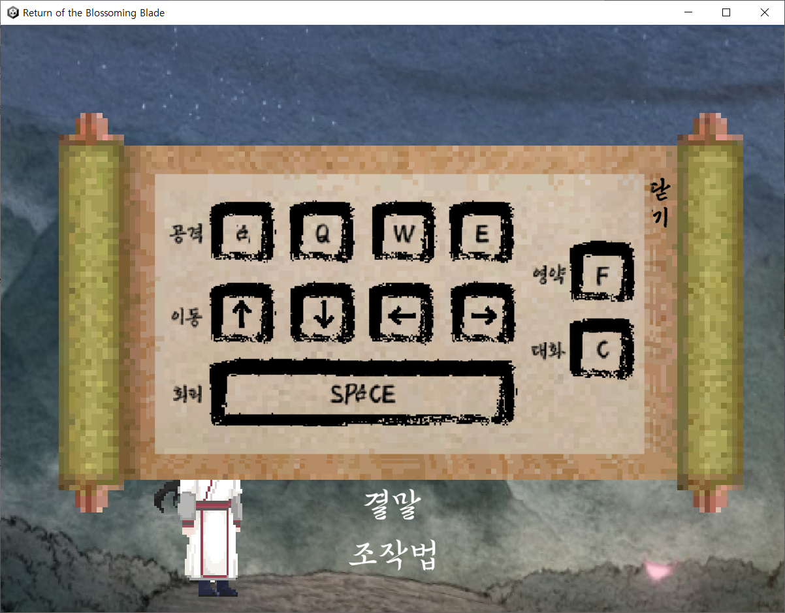
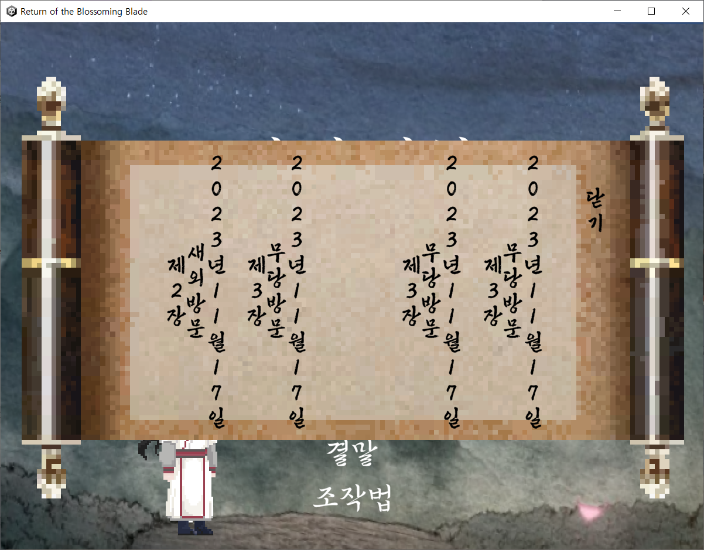
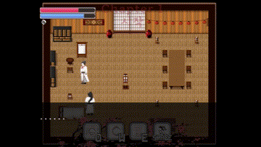
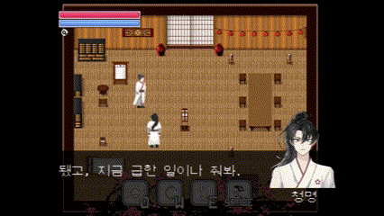
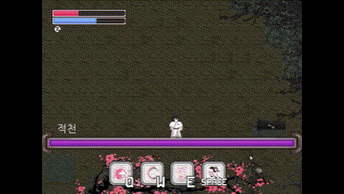

# 화산귀환 : 알려지지 않은 이야기
<!--  -->

## 화산귀환 : 알려지지 않은 이야기 ?
**화산귀환 : 알려지지 않은 이야기** 는 웹소설 화산귀환의 IP 사용을 허락받아 제작한 비상업용 팬 게임으로,  
화산귀환 원작 이전의 스토리를 배경으로 한 스토리 기반 액션 어드벤처 게임입니다.    
원작에 맞춰 캐릭터 에셋을 직접 제작하였고, 원작에 기반한 다양한 맵을 제작하여 게임에 몰입할 수 있도록 하였습니다.
보스마다 다른 패턴의 공격을 사용하여 전투 또한 즐겁게 플레이할 수 있도록 제작하였습니다.

## 🛠 Tech Stacks
- `공통` - Unity (Unity 2021.3.31f1)
- `Front` - React
- `Back` - Java, Springboot

## 🏠 Members
<!-- - 김병민 (https://github.com/)
- 백승은 (https://github.com/se0987)
- 정선재 (https://github.com/seonjae94)
- 정준우 (https://github.com/)  
- 최희주 (https://github.com/ChoiJu34) -->
<table>
  <tbody>
    <tr>
      <td align="center"><a href="https://github.com/Holidaygone"> <b>김병민(Holidaygone)</b></a></td>
      <td align="center"><a href="https://github.com/se0987"> <b>백승은(se0987)</b></a></td>
      <td align="center"><a href="https://github.com/seonjae94"> <b>정선재(seonjae94)</b></a></td>
      <td align="center"><a href="https://github.com/Mi-Gumi"> <b>정준우(Mi-Gumi)</b></a></td>
      <td align="center"><a href="https://github.com/ChoiJu34"> <b>최희주(ChoiJu34)</b></a></td>    
    </tr>
  </tbody>
</table>

## 게임 미리보기

게임의 시작화면 입니다. 처음부터/이어하기/결말/조작법 이 있습니다.   

  

게임의 조작 키를 확인할 수 있습니다.  

  
 

게임을 이어할 수 있습니다.  

 

컷씬을 통해 게임의 몰입감을 높여줍니다.  

  
 
선택지에 따라 다른 대사를 보여줍니다.  

  
 
전투에 대한 튜토리얼을 진행합니다.  

  
 
다양한 보스들이 등장하며, 각각의 보스마다 다른 패턴이 등장합니다.  

  
